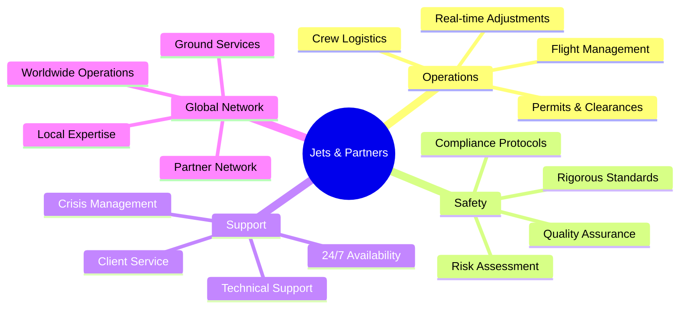

# Jets & Partners

> 70+ years of combined experience in private aviation

Welcome to the official GitHub organization for **Jets & Partners**, a global leader in private jet charter, medevac, cargo operations, and aircraft sales.

## About Us

Jets & Partners delivers precision, safety, and strategic expertise across the private aviation industry. With decades of operational experience, we provide mission-critical aviation services to private clients, corporations, and government agencies worldwide.

Our mission-first mindset ensures every recommendation and operation is tailored to meet our clients' specific needs, from routine charter flights to complex evacuations in challenging environments.

### Key Metrics & Performance

| Metric | Value | Details |
|--------|-------|---------|
| **Combined Experience** | 70+ Years | Decades of expertise across all aviation sectors |
| **Operational Coverage** | 24/7/365 | Continuous operations, every day of the year |
| **Service Areas** | Global | Operations across all continents |
| **Client Satisfaction** | 100% | Unmatched commitment to service excellence |
| **Safety Record** | Exemplary | Zero incidents, rigorous protocols maintained |
| **Response Time** | < 2 Hours | Rapid deployment for urgent requests |
| **Fleet Access** | 50+ Aircraft | Access to diverse aircraft categories worldwide |
| **Crew Experience** | 15+ Years Avg | Highly experienced pilots and support staff |
| **Mission Success Rate** | 100% | Every mission completed as planned |
| **Countries Served** | 150+ | Extensive global network and partnerships |

## Core Services

### ✈️ Private Jet Charter

On-demand private jet charter services with tailored routing, aircraft selection, and full operational oversight. We handle everything from last-minute flight requests to special accommodations on board, ensuring speed, reliability, and discretion.

**Key Features:**
- Tailored routing and aircraft selection
- Last-minute flight requests
- Special accommodations
- Full operational oversight
- Speed, reliability, and discretion

### 🏥 Medevac Services

Medical evacuations and repatriations managed with speed, discretion, and clinical oversight. We utilize ICU-equipped aircraft with comprehensive ground coordination to ensure patient safety and comfort.

**Key Features:**
- ICU-equipped aircraft
- Speed and discretion
- Clinical oversight
- Ground coordination
- Patient safety focus

### 📦 Cargo Operations

Urgent and sensitive air cargo operations, including:
- High-value freight
- Humanitarian aid
- Time-critical shipments
- Routing, compliance, and secure handling from origin to destination

### 🛩️ Aircraft Sales

Full-service aircraft sales with speed, accuracy, and complete market visibility. Our team manages complex acquisitions and placements across private, corporate, and government sectors.

## Specialized Operations

| Operation Type | Description | Availability |
|----------------|-------------|--------------|
| **War Zone Evacuations** | Complex extractions from high-risk areas | 24/7 |
| **Crisis Response** | Rapid deployment for emergency situations | 24/7 |
| **Humanitarian Missions** | Aid delivery and disaster relief | On-Demand |
| **Government Services** | Specialized operations for agencies | Contracted |

## Our Expertise

### Operational Coordination

- **Flight Management**: End-to-end flight management from planning to completion
- **Permits & Clearances**: International permits and clearances
- **Crew Logistics**: Aircraft positioning and crew logistics
- **Real-time Adjustments**: Operational flexibility and real-time adjustments

### Safety First

- Rigorous safety standards and compliance protocols
- Continuous quality assurance
- Risk assessment and mitigation
- Zero incident record

### 24/7 Support

- Round-the-clock operational support
- Crisis response team
- Multilingual customer service
- Technical assistance

## Fleet Highlights

### Our Aircraft

| Aircraft | Registration | Base Location | Status | Capabilities |
|----------|-------------|---------------|--------|--------------|
| **Gulfstream G-IV** | 5T-PCL | Mohammed V International Airport, Casablanca 🇲🇦 | ✅ **Active** | Long-range intercontinental operations |
| **Beechcraft King Air 200** | TBA | Operational | ✅ **Active** | Versatile multi-mission operations |

**Our Fleet:** Jets & Partners operates a **Gulfstream G-IV**, registered **5T-PCL** and homebased at Mohammed V International Airport in Casablanca, Morocco, alongside our versatile **Beechcraft King Air 200** aircraft, expanding our operational capabilities for diverse mission requirements.

### Access to Diverse Fleet Categories

Our operations include access to a carefully selected range of aircraft:

- **Light Jets** - Regional travel, 4-7 passengers
- **Midsize Jets** - Continental reach, 7-9 passengers
- **Super Midsize Jets** - Extended range, 8-10 passengers
- **Heavy Jets** - Intercontinental, 10-16 passengers
- **Ultra Long Range** - Global capability, 12-19 passengers
- **VIP Airliners** - Large groups, custom configurations
- **Medevac Aircraft** - ICU-equipped, medical missions

## Technology & Development

This GitHub organization hosts our **technical projects, tools, and resources** that support our aviation operations. Our development efforts focus on:

### Development Focus Areas

**Operational Management Systems**
- Flight coordination platforms
- Real-time tracking systems
- Resource allocation tools

**Safety & Compliance**
- Compliance tracking
- Safety reporting systems
- Audit management

**Client Services**
- Booking platforms
- Client portals
- Communication systems

**Internal Automation**
- Workflow optimization
- Data analytics
- Process automation

## For Developers

If you're part of the Jets & Partners team or a collaborator:

- Follow our coding standards and contribution guidelines
- Ensure all code meets our safety and security requirements
- Document your work thoroughly
- Reach out to the technical team for questions or support

## Connect With Us

**Headquarters:**

**Casablanca, Morocco 🇲🇦**  
Mohammed V International Airport  
Casablanca, Morocco

**California, USA 🇺🇸**  
California, United States

**Website:** [jets.partners](https://jets.partners)  
**Services:** [View Our Services](https://jets.partners/services/)  
**About:** [Learn More About Us](https://jets.partners/about/)  
**Contact:** [Get in Touch](https://jets.partners/contact/)

## Why Choose Jets & Partners?

- **70+ Years Experience** - Decades of combined expertise in private aviation operations
- **Global Reach** - Worldwide operations with local expertise and partner networks
- **Safety First** - Rigorous standards and exemplary safety record
- **24/7 Support** - Round-the-clock operational support and crisis response
- **Mission-First** - Every operation tailored to client-specific requirements
- **Trusted Partner** - Serving private clients, corporations, and government agencies

---

**Jets & Partners** | Excellence in Aviation

*Where experience meets innovation*

© 2025 Jets & Partners. All rights reserved.

