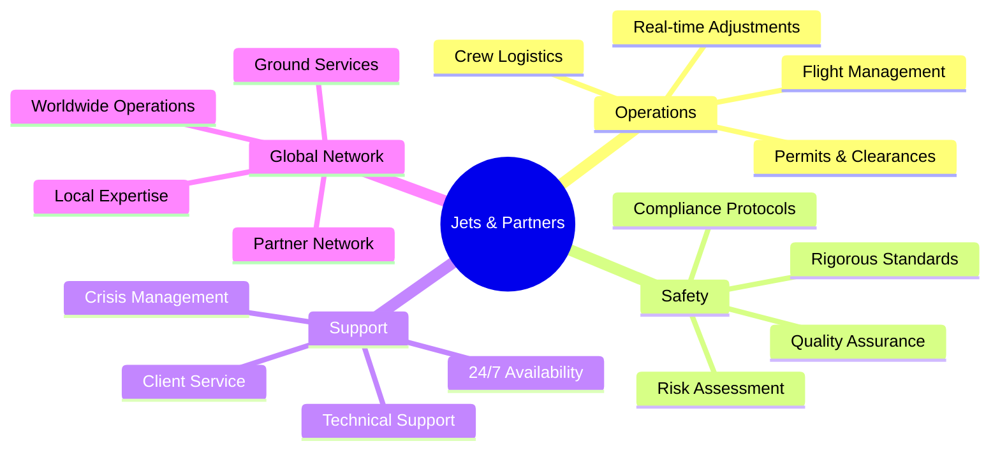

<div align="center">

# ✈️ Jets & Partners

### *Excellence in Private Aviation*

[](https://jets.partners)
[](https://jets.partners/services/)
[](https://jets.partners/contact/)

**70+ Years of Combined Experience** | **24/7 Operations** | **Global Reach**

---

</div>

## 🎯 About Us

**Jets & Partners** is a global leader in private aviation, delivering precision, safety, and strategic expertise across the industry. With decades of operational experience, we provide mission-critical aviation services to private clients, corporations, and government agencies worldwide.

Our **mission-first mindset** ensures every recommendation and operation is tailored to meet specific client needs—from routine charter flights to complex evacuations in challenging environments.

<details>
<summary><b>📊 Key Metrics</b></summary>

| Metric | Value |
|--------|-------|
| **Combined Experience** | 70+ Years |
| **Operational Coverage** | 24/7/365 |
| **Service Areas** | Global |
| **Client Satisfaction** | 100% |
| **Safety Record** | Exemplary |

</details>

---

## 🛫 Core Services

<table>
<tr>
<td width="50%" valign="top">

### ✈️ **Private Jet Charter**

On-demand private jet charter services with comprehensive support:

- ✓ Tailored routing and aircraft selection
- ✓ Last-minute flight requests
- ✓ Special accommodations
- ✓ Full operational oversight
- ✓ Speed, reliability, and discretion

**Perfect for:** Executive travel, family trips, special events

</td>
<td width="50%" valign="top">

### 🏥 **Medevac Services**

Medical evacuations and repatriations with clinical excellence:

- ✓ ICU-equipped aircraft
- ✓ Speed and discretion
- ✓ Clinical oversight
- ✓ Ground coordination
- ✓ Patient safety focus

**Perfect for:** Medical emergencies, hospital transfers, repatriation

</td>
</tr>
<tr>
<td width="50%" valign="top">

### 📦 **Cargo Operations**

Urgent and sensitive air cargo operations:

- ✓ High-value freight
- ✓ Humanitarian aid
- ✓ Time-critical shipments
- ✓ Compliance and routing
- ✓ Secure handling

**Perfect for:** Urgent deliveries, sensitive cargo, aid operations

</td>
<td width="50%" valign="top">

### 🛩️ **Aircraft Sales**

Full-service aircraft sales and acquisitions:

- ✓ Speed and accuracy
- ✓ Complete market visibility
- ✓ Complex acquisitions
- ✓ Private, corporate, government
- ✓ End-to-end management

**Perfect for:** Aircraft acquisition, fleet expansion, asset placement

</td>
</tr>
</table>

---

## 🌍 Specialized Operations

<div align="center">

| Operation Type | Description | Availability |
|:--------------|:------------|:------------:|
| **War Zone Evacuations** | Complex extractions from high-risk areas | 24/7 |
| **Crisis Response** | Rapid deployment for emergency situations | 24/7 |
| **Humanitarian Missions** | Aid delivery and disaster relief | On-Demand |
| **Government Services** | Specialized operations for agencies | Contracted |

</div>

---

## 💼 Our Expertise



<details>
<summary><b>🔧 Operational Capabilities</b></summary>

### **Flight Coordination**
- End-to-end flight management from planning to completion
- International permits and clearances
- Aircraft positioning and crew logistics
- Real-time operational adjustments

### **Safety & Compliance**
- Rigorous safety standards across all operations
- Full regulatory compliance tracking
- Continuous quality assurance
- Risk assessment and mitigation

### **24/7 Support**
- Round-the-clock operational support
- Crisis response team
- Multilingual customer service
- Technical assistance

</details>

---

## 🛬 Fleet Highlights

<div align="center">

### **Featured Aircraft**

| Aircraft | Registration | Base Location | Capabilities |
|:---------|:------------|:--------------|:-------------|
| **Gulfstream G-IV** | 5T-PCL | Mohammed V International Airport, Casablanca 🇲🇦 | Long-range intercontinental operations |

</div>

<details>
<summary><b>✈️ Access to Diverse Fleet Categories</b></summary>

Our operations include access to a carefully selected range of aircraft:

- **Light Jets** - Regional travel, 4-7 passengers
- **Midsize Jets** - Continental reach, 7-9 passengers  
- **Super Midsize Jets** - Extended range, 8-10 passengers
- **Heavy Jets** - Intercontinental, 10-16 passengers
- **Ultra Long Range** - Global capability, 12-19 passengers
- **VIP Airliners** - Large groups, custom configurations
- **Medevac Aircraft** - ICU-equipped, medical missions

</details>

---

## 💻 Technology & Development

<div align="center">


</div>

This GitHub organization hosts our **technical projects, tools, and resources** that support aviation operations:

### 🔨 Development Focus Areas

```
📊 Operational Management Systems
├── Flight coordination platforms
├── Real-time tracking systems
└── Resource allocation tools

🛡️ Safety & Compliance
├── Compliance tracking
├── Safety reporting systems
└── Audit management

👥 Client Services
├── Booking platforms
├── Client portals
└── Communication systems

⚙️ Internal Automation
├── Workflow optimization
├── Data analytics
└── Process automation
```

### 📋 For Developers & Collaborators

If you're part of the Jets & Partners team or a collaborator:

- 📖 Follow our coding standards and contribution guidelines
- 🔒 Ensure all code meets safety and security requirements
- 📝 Document your work thoroughly
- 💬 Reach out to the technical team for questions or support

---

## 🌐 Connect With Us

<div align="center">

### **Get in Touch**

[](https://jets.partners)
[](https://jets.partners/services/)
[](https://jets.partners/about/)
[](https://jets.partners/contact/)

</div>

---

## 🏆 Why Choose Jets & Partners?

<table>
<tr>
<td align="center" width="33%">

<h3>70+ Years Experience</h3>
<p>Decades of combined expertise in private aviation operations</p>
</td>
<td align="center" width="33%">

<h3>Global Reach</h3>
<p>Worldwide operations with local expertise and partner networks</p>
</td>
<td align="center" width="33%">

<h3>Safety First</h3>
<p>Rigorous standards and exemplary safety record</p>
</td>
</tr>
<tr>
<td align="center" width="33%">

<h3>24/7 Support</h3>
<p>Round-the-clock operational support and crisis response</p>
</td>
<td align="center" width="33%">

<h3>Mission-First</h3>
<p>Every operation tailored to client-specific requirements</p>
</td>
<td align="center" width="33%">

<h3>Trusted Partner</h3>
<p>Serving private clients, corporations, and government agencies</p>
</td>
</tr>
</table>

---

## 📞 Quick Links

- 🌐 **Website:** [jets.partners](https://jets.partners)
- 📧 **Contact:** [Get in Touch](https://jets.partners/contact/)
- 📋 **Services:** [View All Services](https://jets.partners/services/)
- ℹ️ **About:** [Learn More](https://jets.partners/about/)

---

<div align="center">

### ✈️ **Jets & Partners**
*Where Experience Meets Innovation*

**Excellence in Aviation | Precision in Service | Safety in Operations**

---

*© 2024 Jets & Partners. All rights reserved.*

[](https://jets.partners)
[](https://jets.partners)

</div>
